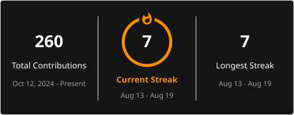

<!-- ================= HEADER ================= -->

<h1 align="center">🚀 Pawan Sain</h1>

<h3 align="center">
Computer Science Student • Data Analyst • Full Stack Developer
</h3>

  

---

# ⚡ About Me

🎓 B.Tech Computer Science & Engineering Student at **JECRC University**  
📍 Jaipur, Rajasthan, India

I'm a **Computer Science student** passionate about **Data Analytics** and **Full Stack Development**. I enjoy working with data to discover meaningful business insights and building modern web applications that solve real-world problems.

- 📊 Aspiring **Data Analyst**
- 💻 Full Stack Developer
- 📈 Working with **Power BI, SQL, Excel & Python**
- 🌐 Building applications with **React, Node.js, Express.js & MongoDB**
- 🧠 Improving my **Data Structures & Algorithms**
- 🚀 Building real-world projects
- 📚 Continuously learning and exploring modern technologies

  🎯 <b>Turning Data into Insights & Ideas into Applications.</b>

---

# 🛠️ Skills & Technologies

## Frontend

  

---

## Backend

  

---

## Data Analytics

  
  
  
  
  
  

---

## Tools

  
  

---

# 💡 Currently Working On

- 🧠 Improving **Data Structures & Algorithms**
- ⚛️ Building modern **React.js projects**
- 🌐 Developing **Full Stack Web Applications**
- 📊 Creating interactive **Power BI dashboards**
- 🐍 Improving **Python for Data Analysis**
- 🗄️ Strengthening **SQL for Data Analytics**
- 🚀 Building and deploying real-world projects

---

# 🚀 Featured Projects

| Project | Description |
|---|---|
| 💰 **Expense Tracker App** | Full Stack expense management application with authentication, expense tracking, dashboard, REST APIs and MongoDB |
| 📊 **Blinkit Grocery Analysis** | Interactive Power BI dashboard for sales, customer, product and delivery analysis |
| 📱 **Mobile Sales Analysis** | Power BI dashboard analyzing sales performance, brands, revenue trends and customer insights |
| 📈 **Sales Performance Insights** | Business Intelligence dashboard focused on sales KPIs, profit analysis and business performance |

### 💰 Expense Tracker App

**Full Stack Expense Management Application**

**Features:**
- 🔐 User Authentication
- 💰 Expense & Income Tracking
- 📊 Interactive Dashboard
- 🔄 REST APIs
- 🗄️ MongoDB Database

🔗 **Live Demo:**  
https://expense-tracker-app-rho-mocha.vercel.app

---

### 📊 Blinkit Grocery Analysis

**Power BI Business Intelligence Dashboard**

**Analysis includes:**
- 💰 Sales Analysis
- 👥 Customer Insights
- 📦 Product Analysis
- 📊 KPI Dashboard
- 🔎 Dynamic Filters
- 📐 DAX Measures
- 🚚 Delivery Performance

**Tools:** Power BI • DAX • Power Query • Data Modeling

---

### 📱 Mobile Sales Analysis

**Power BI Business Intelligence Dashboard**

**Analysis includes:**
- 📈 Sales Performance
- 🏷️ Brand Analysis
- 💰 Revenue Trends
- 👥 Customer Insights
- 📊 Interactive Visualizations

**Tools:** Power BI • DAX • Power Query

---

### 📈 Sales Performance Insights

**Business Intelligence Dashboard**

**Analysis includes:**
- 📊 Sales KPIs
- 💰 Profit Analysis
- 👥 Customer Insights
- 📈 Business Performance
- 📊 Interactive Visualizations

**Tools:** Power BI • DAX • Power Query

---

# 🏆 Certifications & Learning

- 🎓 Google Data Analytics Professional Certificate
- 📊 Excel Basics for Data Analysis — Coursera
- 🗄️ SQL Basics — HackerRank
- 🐍 Python — GeeksforGeeks
- ☁️ Google Cloud Career Launchpad — Computing Foundations
- 🤖 AI for Beginners — HP LIFE
- 📈 Deloitte Data Analytics Job Simulation
- 🌐 Introduction to Front-End Development — Coursera
- 💻 Full Stack Development — Decode Labs

---

# 📊 GitHub Analytics

  

---

# 📈 Contribution Graph

  

---

# 🐍 Contribution Snake

  

---

# 🌐 Connect With Me

📧 <b>Email:</b> pawansa2006@gmail.com

---

# 💬 Quote

### **"Turning Data into Insights & Ideas into Applications."**

⭐ If you like my work, don't forget to star my repositories!

